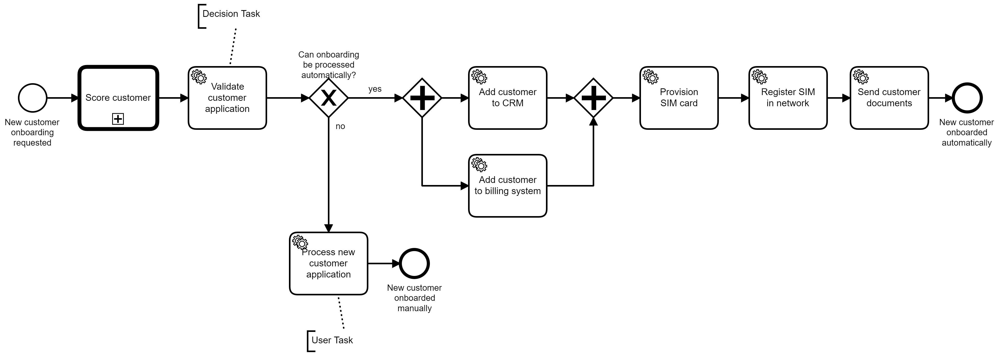
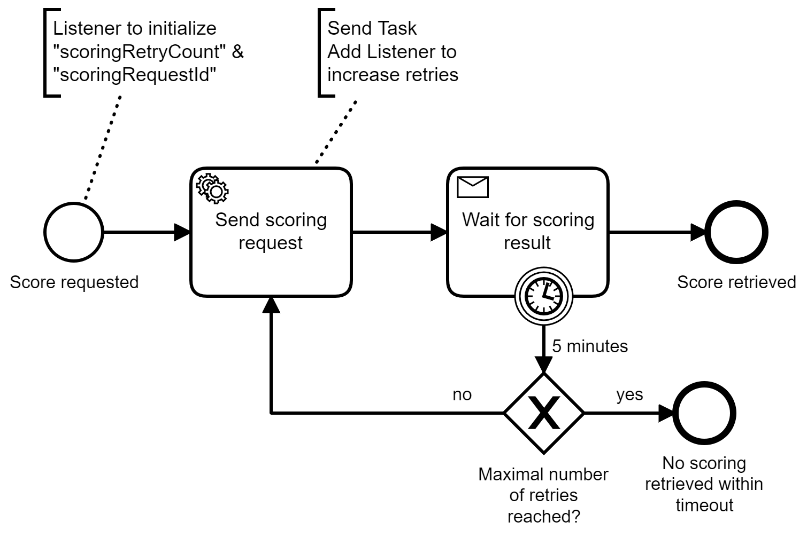

# customer-onboarding-camundacloud-springboot-amqp

Simple example for application processing workflow using Camunda Cloud, Java, Spring Boot, REST and AMQP

The AMQP details are extracted in an own subprocess:

